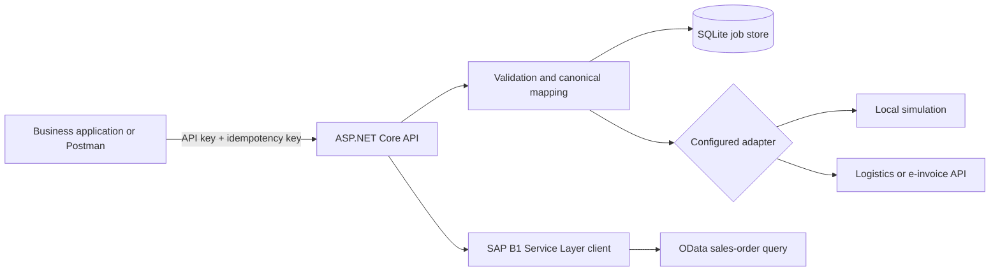

# Business Application Integration Service

A portfolio-grade ASP.NET Core service for reliable system-to-system integrations. It accepts logistics shipment and electronic invoice events, maps them to canonical JSON, records every delivery attempt in SQLite, and sends them to configurable downstream APIs. A separate SAP Business One Service Layer boundary demonstrates OData query construction and session-cookie authentication without claiming access to a live ERP.

This project was built for an Integration Developer portfolio and focuses on the practical concerns that make small integrations maintainable: authentication, validation, idempotency, correlation IDs, structured errors, persistence, retry, logging, tests, and operational documentation.

## What is implemented

- ASP.NET Core 8 Minimal APIs with API-key protection
- Shipment and electronic invoice integration pipelines
- Canonical JSON mapping at the system boundary
- SQLite persistence through Entity Framework Core
- Idempotent submission with payload-conflict detection
- Correlation ID propagation and structured logging
- Failed-job state retention and controlled retry
- Replaceable simulated and HTTP outbound adapters
- Bearer-token support for downstream APIs
- SAP Business One Service Layer read adapter using OData and `B1SESSION`
- Problem Details responses for validation and integration failures
- Postman collection and local environment
- Docker image, Docker Compose, and GitHub Actions CI
- 20 automated tests with 88.0% line and 65.33% branch coverage

## Architecture



The API starts in simulation mode, so it can be evaluated without third-party credentials. See [docs/architecture.md](docs/architecture.md) for the component boundaries and delivery behavior.

## Quick start

Requirements: .NET 8 SDK.

```powershell
$env:IntegrationSecurity__ApiKey = "local-development-key"
dotnet restore
dotnet run --project src/Integration.Api
```

Open `http://localhost:5000/health` if the console reports that address, or use the address emitted by `dotnet run`. To force a predictable URL:

```powershell
$env:ASPNETCORE_URLS = "http://localhost:8080"
$env:IntegrationSecurity__ApiKey = "local-development-key"
dotnet run --project src/Integration.Api
```

Submit a shipment:

```powershell
$headers = @{
  "X-Integration-Key" = "local-development-key"
  "Idempotency-Key" = "shipment-demo-001"
  "X-Correlation-ID" = "portfolio-demo"
}
$body = @{
  sourceSystem = "warehouse"
  shipmentId = "SHP-1001"
  orderReference = "SO-9001"
  carrierCode = "DHL"
  trackingNumber = "TRACK-1001"
  status = "Dispatched"
  occurredAtUtc = "2026-07-27T09:00:00Z"
  destinationCountry = "ES"
} | ConvertTo-Json

Invoke-RestMethod `
  -Method Post `
  -Uri "http://localhost:8080/api/v1/logistics/shipments" `
  -Headers $headers `
  -ContentType "application/json" `
  -Body $body
```

The first valid submission returns `202 Accepted`; an identical request with the same idempotency key returns the existing job with `duplicate: true`. Reusing the key with a different payload returns `409 Conflict`.

## Docker

```powershell
$env:INTEGRATION_API_KEY = "local-development-key"
docker compose up --build
```

The service is then available at `http://localhost:8080`. The Compose file mounts a named volume for SQLite persistence and never embeds the API key in the image.

## Configuration

Environment variables use ASP.NET Core double-underscore notation.

| Setting | Purpose | Default |
| --- | --- | --- |
| `IntegrationSecurity__ApiKey` | Required inbound API key | none |
| `ConnectionStrings__IntegrationDatabase` | EF Core SQLite connection | `Data Source=integration.db` |
| `Outbound__UseHttp` | Use real HTTP targets instead of simulation | `false` |
| `Outbound__LogisticsUrl` | Shipment target URL | placeholder |
| `Outbound__EInvoiceUrl` | E-invoice target URL | placeholder |
| `Outbound__BearerToken` | Optional downstream bearer token | empty |
| `SapServiceLayer__UseHttp` | Use HTTP SAP adapter instead of simulation | `false` |
| `SapServiceLayer__BaseUrl` | SAP Business One Service Layer base URL | placeholder |
| `SapServiceLayer__SessionToken` | SAP `B1SESSION` value | empty |

Never commit real credentials. Use a secrets manager or deployment-platform secret injection outside local development.

## API surface

| Method | Route | Purpose |
| --- | --- | --- |
| `GET` | `/health` | Unauthenticated liveness response |
| `POST` | `/api/v1/logistics/shipments` | Validate, map, persist, and dispatch a shipment |
| `POST` | `/api/v1/e-invoices` | Validate, map, persist, and dispatch an invoice |
| `GET` | `/api/v1/jobs/{jobId}` | Inspect integration state |
| `POST` | `/api/v1/jobs/{jobId}/retry` | Retry a failed job |
| `GET` | `/api/v1/sap-business-one/sales-orders?updatedSince=...` | Read updated SAP sales orders |

The included [Postman collection](postman/Business-Application-Integration-Service.postman_collection.json) covers the supported flows.

## Verification

```powershell
dotnet build BusinessApplicationIntegration.sln --configuration Release
dotnet test BusinessApplicationIntegration.sln `
  --configuration Release `
  --no-build `
  --collect:"XPlat Code Coverage"
```

The current suite covers request authentication, validation, canonical mappings, idempotent duplicates and conflicts, persistence, retry state rules, HTTP bearer/correlation headers, SAP session/OData behavior, and successful invoice/shipment flows.

## Documentation

- [Architecture and design decisions](docs/architecture.md)
- [Requirements traceability](docs/requirements.md)
- [Operations runbook](docs/operations.md)
- [Scope and limitations](docs/limitations.md)

## Scope

This is a self-contained portfolio implementation, not a Kurita system and not connected to SAP, logistics providers, or e-invoicing vendors. The HTTP clients are genuine integration boundaries exercised with controlled test doubles. Vendor-specific schemas, authentication renewal, queue infrastructure, and deployment hardening would be completed with the relevant organizations in a real engagement.
