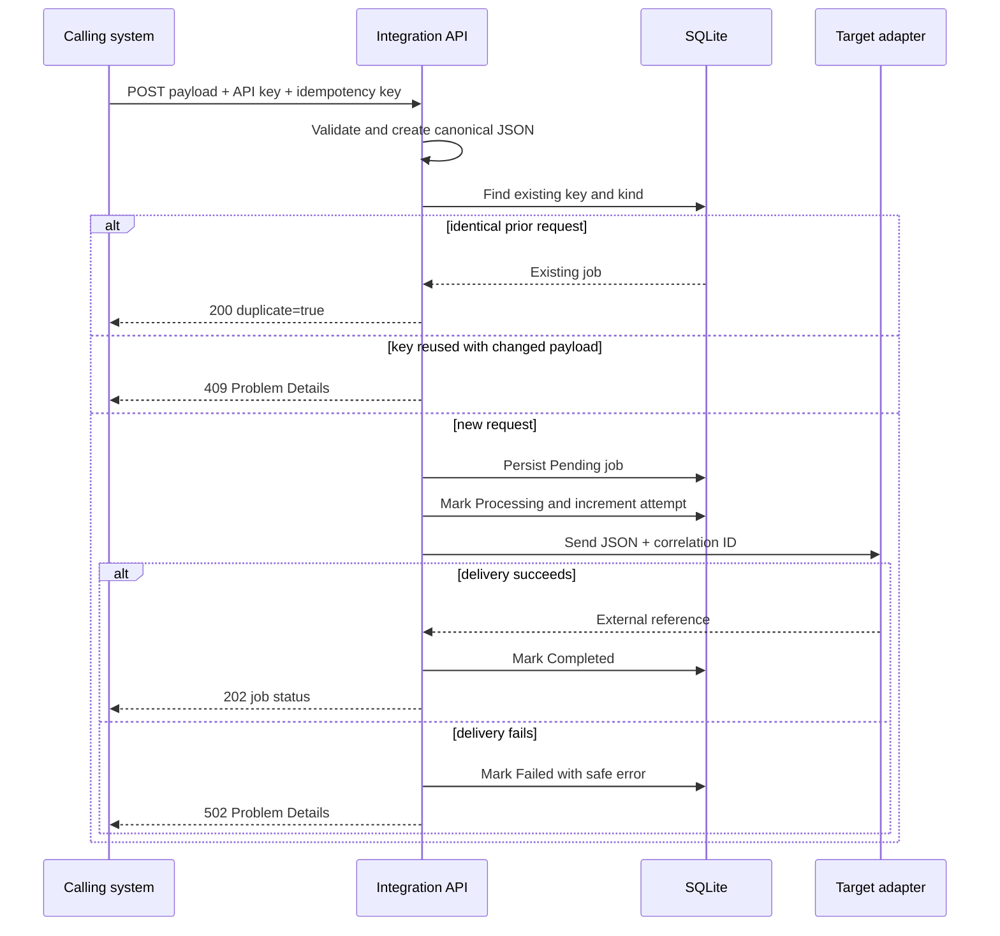

# Architecture and design decisions

## Component model

The service separates transport, orchestration, persistence, and external-system concerns:

- **Endpoints** validate HTTP contracts and translate protocol details into application calls.
- **Canonical mapper** isolates business-facing payloads from downstream transport schemas.
- **Integration orchestrator** applies idempotency, persists state, dispatches work, and records the outcome.
- **EF Core job store** provides an auditable local record with a unique integration-kind/idempotency-key constraint.
- **Outbound adapter** switches between deterministic simulation and a real HTTP boundary.
- **SAP client** switches between simulation and an HTTP/OData boundary for SAP Business One Service Layer.
- **Middleware** applies correlation IDs and API-key authentication consistently.
- **Exception handler** returns Problem Details without exposing stack traces or secrets.

## Delivery sequence

## Key decisions

### Idempotency

The client supplies `Idempotency-Key`. The service hashes the canonical payload with SHA-256 and stores the hash with the key and integration kind. An exact replay returns the original job; a changed payload under the same key is rejected. The database constraint is the final guard against duplicate rows.

### Synchronous dispatch for a transparent portfolio

The request currently dispatches synchronously after durable state creation. This keeps the delivery sequence observable and testable without requiring a message broker. A production scale-out should use a transactional outbox plus a background worker or managed queue to close the process-crash window between state changes.

### Adapter replacement

`Outbound:UseHttp` and `SapServiceLayer:UseHttp` select the concrete clients during startup. Simulation is safe for local evaluation. Real clients use `IHttpClientFactory`, validate URLs, propagate correlation, and keep tokens in runtime configuration.

### SAP Business One boundary

The SAP client demonstrates a narrow read capability:

- OData query construction for sales orders updated since a UTC instant
- Explicit field selection and ordering
- `B1SESSION` cookie authentication
- Response-envelope mapping to an internal record

It deliberately does not simulate a full SAP installation or claim production validation.

### Security

The implementation uses fixed-time comparison for the inbound API key, avoids credential logging, and returns generic operational errors. Production deployment should add TLS termination, network policy, secret rotation, rate limiting, audit retention, and organization-specific identity controls.
