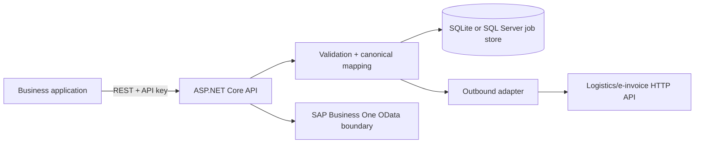
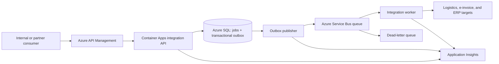

# API and integration strategy

## Scope and evidence boundary

This document separates the service that is implemented today from a proposed
Azure integration target. It is an architecture exercise for a representative
logistics, e-invoice, and ERP landscape; it is not based on a customer
engagement and does not claim a production deployment.

The current repository implements and tests the ASP.NET Core API, canonical
mapping, persisted delivery state, idempotency, retry, HTTP adapters, and a SAP
Business One OData boundary. The OpenAPI contract describes those routes. The
AsyncAPI contract and Azure Service Bus path describe the next migration stage
and are deliberately marked as target-state work.

## Drivers

The example landscape has four needs:

1. expose stable integration contracts without coupling callers to downstream
   logistics, invoicing, or ERP schemas;
2. preserve traceability from the inbound request to every delivery attempt;
3. isolate downstream outages and control replay without creating duplicates;
4. move integrations incrementally instead of replacing all existing flows at
   once.

## Current state: implemented

The current synchronous dispatch keeps the reference implementation easy to
run and inspect. It also leaves a process-crash window after a job is persisted
but before downstream delivery is confirmed. The repository documents this
limitation rather than presenting the synchronous path as a finished
high-availability design.

## Target state: designed and compiled as infrastructure code

`deploy/azure/main.bicep` compiles the application hosting, SQL, and
observability path. `deploy/azure/integration-platform.bicep` compiles Azure API
Management and a duplicate-detecting Service Bus queue. The application does
not yet write an outbox record or publish to Service Bus; those are explicit
entry and exit criteria in the modernization roadmap.

## API-first rules

- Treat `contracts/openapi.yaml` as the reviewed public contract. A route change
  is complete only when the contract, implementation, tests, and examples agree.
- Keep the `/api/v1` major-version boundary. Prefer additive fields for
  compatible changes; introduce a new major route only for breaking semantics.
- Put consumer authentication, subscription control, throttling, and correlation
  header creation at API Management. Keep service-level authorization because
  the backend must not rely solely on network location.
- Require an idempotency key for commands. Reuse of a key with changed canonical
  content is a conflict, not a second request.
- Return Problem Details for protocol errors and retain delivery state for
  operational errors. Do not expose credentials or downstream stack traces.
- Use consumer-specific products and policies in API Management instead of
  forking the service contract for each partner.

## Event-driven rules

The target contract is `contracts/integration-events.asyncapi.yaml`.

- Persist the integration job and outbox record in one database transaction.
- Use the outbox record identifier as the Service Bus message ID so broker-side
  duplicate detection complements consumer idempotency.
- Propagate correlation ID, schema version, integration kind, and source system
  in message metadata.
- Complete a message only after the target confirms delivery. Abandon transient
  failures and dead-letter messages after the configured delivery limit.
- Restrict replay to an audited operational action; never copy dead-letter
  messages into the active queue without checking the failure cause and target
  side effects.
- Evolve events additively within a schema version. Publish a new message name or
  version when a consumer-visible meaning changes.

## Pattern selection

| Concern | Selected pattern | Reason | Trade-off |
| --- | --- | --- | --- |
| Changing source and target schemas | Canonical data model + adapters | Localizes mapping and vendor-specific behavior | Canonical models require ownership and versioning |
| Caller retries | Idempotent receiver | Prevents duplicate jobs for the same command | Keys and payload hashes must be retained |
| Reliable asynchronous hand-off | Transactional outbox (target) | Couples database state and publish intent without a distributed transaction | Adds a publisher and backlog monitoring |
| Downstream outage | Queue, bounded retry, dead-letter review (target) | Decouples intake from delivery and preserves failed work | Eventual consistency replaces immediate completion |
| End-to-end investigation | Correlation IDs + persisted attempts + telemetry | Connects API, job, message, and dependency evidence | Retention and data-classification rules are required |
| Incremental replacement | Strangler migration | Moves one flow at a time with rollback | Temporary coexistence increases operational complexity |

## Hybrid integration boundary

During migration, cloud entry points may call systems that remain on-premises.
The preferred boundary is an outbound-initiated, encrypted connection from an
approved network component; direct public exposure of an ERP endpoint is not an
acceptable default. Exact networking, private endpoints, DNS, firewall rules,
and identity federation depend on the organization's landing zone and are not
implemented in this repository.

## Security, availability, and operations

- Use managed identities and disable local Service Bus authentication. The
  target template creates the namespace with local authentication disabled; role
  assignments belong in an environment-specific deployment layer.
- Store application secrets in a managed secret store and rotate them. The
  sample Container Apps template accepts secure parameters but is not a complete
  enterprise secret-management design.
- Keep API Management subscription controls and rate limits separate from
  application authorization.
- Define service-level objectives before sizing. Scale settings, queue depth,
  oldest-message age, failed deliveries, and dependency latency need alerts.
- Exercise restore, dead-letter replay, and downstream outage procedures before
  production cutover. A compiled template is not evidence of availability.

## Decision ownership

API and event contracts need one accountable owner, named consumers, a change
review process, and a retirement date for superseded versions. Platform teams
own shared APIM and Service Bus guardrails; each integration team owns its
contract, mapping, tests, dashboard, and runbook. This repository supplies
technical artifacts, not an organizational governance mandate.
